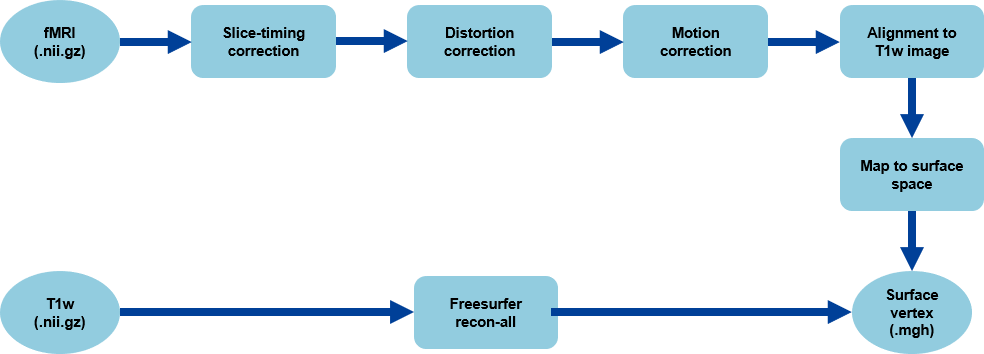

# A large-scale vision-language fMRI dataset for multi-modal semantic processing

---
## About
This repository provides codes for our large-scale fMRI dataset, focusing on four core components:
* Preprocessing pipelines for fMRI data in the `./preprocess/` folder.
* Quality control tools for assessing preprocessing and data reliability in the `./quality_control/` folder.
* Beta estimation using GLMSingle in the `./beta_estimate/` folder.
* Voxel-wise encoding model code for caption stimuli in the `./encoding/` folder.

---
## Experimental paradigm
Participants performed a text–image semantic matching task in which captions and images were presented in an alternating sequence, and participants judged whether each pair conveyed the same meaning.
<p align="center">
  
</p>

---
## Preprocessing pipeline
Below is the overview of preprocessing pipeline. The detailed procedures and implementation scripts are available in the `./preprocess/` folder.
<p align="center">
  
</p>

---
## Quality control
Below is the QC overview demo showing cross-session alignment results for participant sub-03. The detailed QC procedures and implementation scripts are available in the `./quality_control/` folder.
<p align="center">
  
</p>

---
## Citation
If you use this dataset or the accompanying code, please cite the following abstract presented in Journal of Vision:

Li, Y., Li, S., Jin, Z., Gu, S., & Zhang, R. Y. (2025). A large-scale vision-language fMRI dataset for multi-modal semantic processing. Journal of Vision, 25(9), 2445–2445.

### **BibTeX**
```bibtex
@article{li2025large,
  title={A large-scale vision-language fMRI dataset for multi-modal semantic processing},
  author={Li, Yuanning and Li, Shurui and Jin, Zheyu and Gu, Shi and Zhang, Ru-Yuan},
  journal={Journal of Vision},
  volume={25},
  number={9},
  pages={2445--2445},
  year={2025},
  publisher={The Association for Research in Vision and Ophthalmology}
}
```

---
## License
This repository is released under the **CC BY-NC-ND 4.0** license.  
You may use the code for research and educational purposes, but commercial use, distribution of modified versions, or sublicensing are not permitted.


For full terms, please refer to the [LICENSE](./LICENSE) file.
