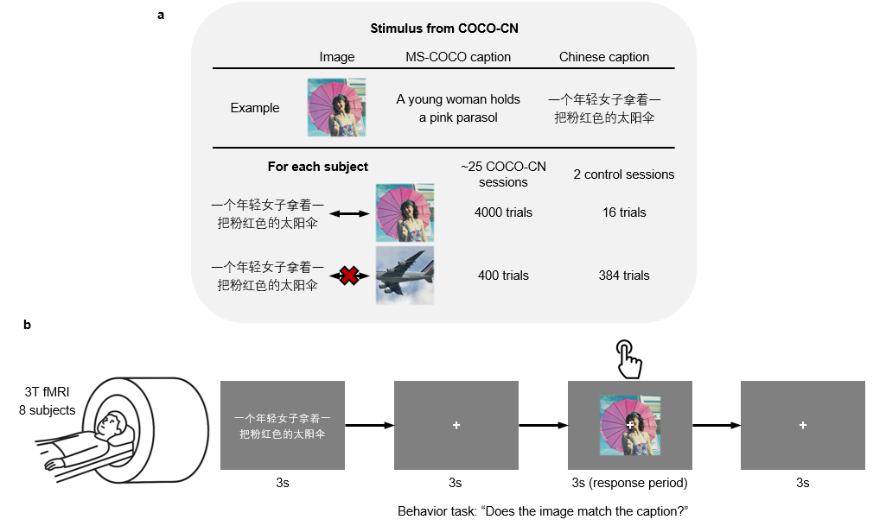

# A large-scale vision-language fMRI dataset for multi-modal semantic processing

---
## About
This repository provides codes for our large-scale fMRI dataset, focusing on four core components:
* Preprocessing pipelines for fMRI data
* Quality control tools for assessing preprocessing and data reliability
* Beta estimation using GLMSingle
* Voxel-wise encoding model code for caption stimuli

---
## Experimental Paradigm Overvew

  

