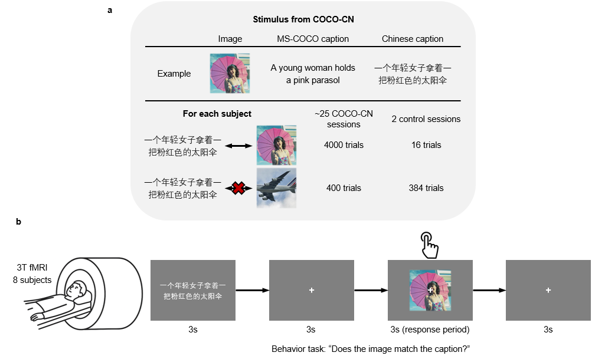
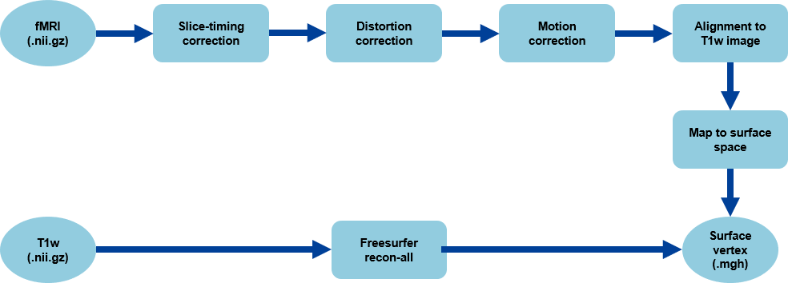

# A large-scale vision-language fMRI dataset for multi-modal semantic association

--- 
## Notes
We are currently updating a small subset of the released data files to correct file naming and organization issues. Some files may be temporarily unavailable during this process and will be re-uploaded after the update is completed. 

We will complete the data update as soon as possible.

If you need access to the relevant data during this period, please concat lishr2022@shanghaitech.edu.cn.

---
## About
This repository provides codes for our large-scale fMRI dataset, focusing on four core components:
* **Article**: Paper published in [_Scientific Data_](https://doi.org/10.1038/s41597-026-07248-6) (2026).
* **Dataset**: Access the full dataset on [Science Data Bank](https://www.scidb.cn/en/detail?dataSetId=3608457c9c5e4c078ecca153c3413b1b).
* **Preprocessing**: Pipelines for fMRI data in the `./preprocess/` folder.
* **Quality Control**: Tools for assessing preprocessing and data reliability in the `./quality_control/` folder.
* **Beta Estimation**: Using GLMSingle in the `./beta_estimate/` folder.
* **Encoding Models**: Voxel-wise encoding model code for caption stimuli in the `./encoding/` folder.

---
## Experimental paradigm
Participants performed a text–image semantic matching task in which captions and images were presented in an alternating sequence, and participants judged whether each pair conveyed the same meaning.
<p align="center">
  
</p>

---
## Preprocessing pipeline
Below is the overview of preprocessing pipeline. The detailed procedures and implementation scripts are available in the `./preprocess/` folder.
<p align="center">
  
</p>

---
## Quality control
Below is the QC overview demo showing cross-session alignment results for participant sub-07. The detailed QC procedures and implementation scripts are available in the `./quality_control/` folder.
<p align="center">
  
</p>

---
## Citation
If you use this dataset or the accompanying code, please cite our paper published in **_Scientific Data_**:

Li, S., Jin, Z., Gu, S. et al. A large-scale fMRI dataset for vision-language semantic association. _Sci Data_ (2026). https://doi.org/10.1038/s41597-026-07248-6

### **BibTeX**
```bibtex
@article{li2026large,
  title={A large-scale fMRI dataset for vision-language semantic association},
  author={Li, Shurui and Jin, Zheyu and Gu, Shi and Zhang, Ru-Yuan and Li, Yuanning},
  journal={Scientific Data},
  year={2026},
  publisher={Nature Publishing Group UK London}
}
```

---
## Acknowledgements
This work is supported by the **National Science and Technology Major Project of China** (2025ZD0217000, Y.L.), **National Natural Science Foundation of China** (32371154, Y.L.; 32441102, R.-Y.Z), **Shanghai Rising-Star Program** (24QA2705500, Y.L.), and the **Lin Gang Laboratory** (LG-GG-202402-06 and LGL-1987-18, Y.L.). The computations in this research are supported by the HPC Platform of ShanghaiTech University.

We would like to express our sincere gratitude to [**Yu-Qi You**](https://orcid.org/0009-0005-5723-1947) for the insightful discussions and support.

---
## License
This repository is released under the **CC BY-NC-ND 4.0** license.  
You may use the code for research and educational purposes, but commercial use, distribution of modified versions, or sublicensing are not permitted.


For full terms, please refer to the [LICENSE](./LICENSE) file.
